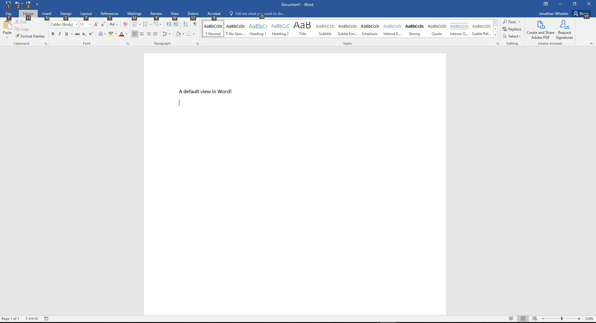
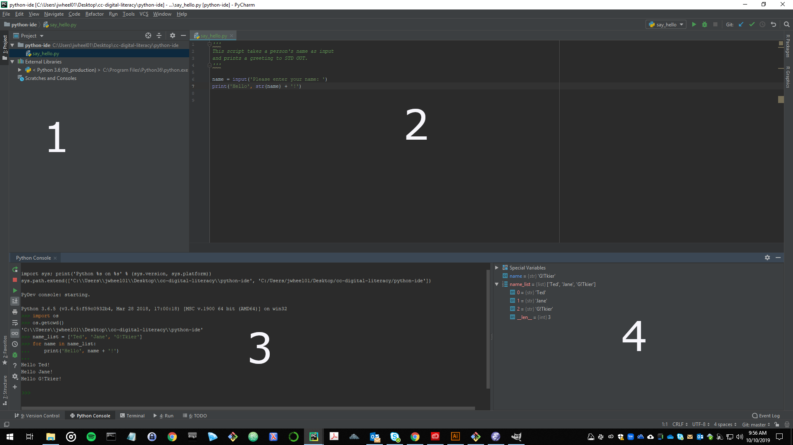
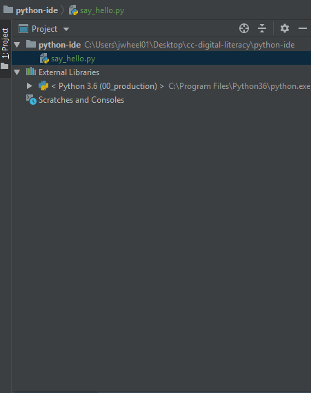
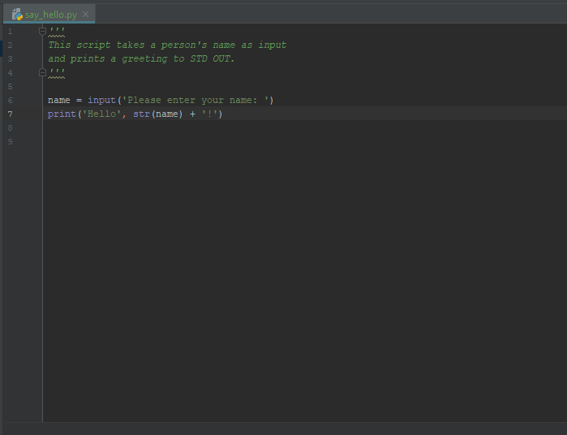
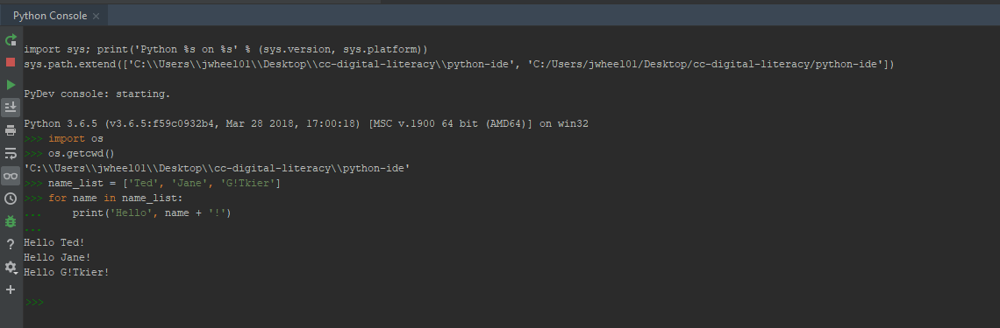
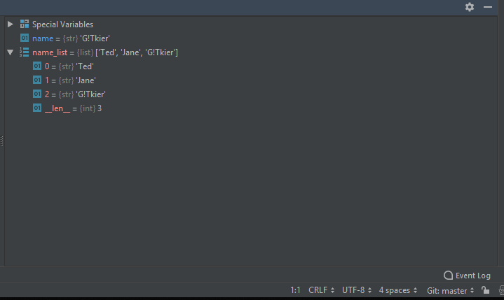

# Introduction to Workspaces with Adobe Illustrator

2019-10-11

There is an excellent tutorial on these and other topics at _An Adobe Illustrator Companion_, by Steven G. Braun: <http://www.stevengbraun.com/ws/intro-adobe-illustrator/>

The sun image used for the raster tracing example is available from Creative Commons:

<a href="http://www.flickr.com/photos/10957255@N08/15102913302">"Sun"</a>by <a href="http://www.flickr.com/photos/10957255@N08">Chris Yarzab</a> is licensed under <a href="https://creativecommons.org/licenses/by-nc-sa/2.0/?ref=ccsearch&atype=html" style="margin-right: 5px;">CC BY-NC-SA 2.0</a>

## Objectives

1. Define IDE and workspaces, differences between these and workflows using traditional productivity applications.
2. Explore Creative Cloud as an IDE.
3. Define use cases for Adobe Illustrator, integrations with other Creative Cloud products.

## Intro to IDE

IDE stands for _integrated development environment_.

* Traditionally used for software development.
* In addition to views and tools for editing code and documents, IDE provide resources for running code, evaluating parameters and variables, information on dependencies and paths, etc.

1. A default view in MS Word:

2. A default view in PyCharm, ,a Python IDE:

3. The IDE includes a file manager:

4. Script editor window in the IDE:

5. IDE will often include interpreters or other scratch tools:

6. Properties of objects in memory:

## Getting started with Illustrator

Adobe Creative Cloud apps have IDE-like features and GUIs. The Creative Cloud suite is a comprehensive IDE for digital design and production.

Let's explore some of these features in Illustrator:

1. Launch Illustrator. Click on _File->New_ or _Create New..._
2. Note settings for templates and presets.
3. We are going to create a postcard, which has a front and a back.
   * Change w/h units to inches and do 5X8
   * Set 'Artboards' to 2
   * Change orientation to landscape.
4. Hit _Create_.

Have a look around the workspace. In what ways is the GUI similar to productivity software like MS Excel or Word? In what ways is the GUI more like the IDE example we just looked at?

1. Tour of the interface - tools, windows, other aspects of the GUI and custom views.
2. In properties, click on document setup.
3. Note options - give both artboards a name. Use _Exit_ to get back to general properties.

## Basic Shapes and Objects

Create vector objects using tools in the _tools panel_.

**NOTE:** There are many shortcut keys which change tool behavior. Some are given here, but the full list is online at <https://helpx.adobe.com/illustrator/using/default-keyboard-shortcuts.html#Exportkeyboardshortcutlistasatextdocument> and also through the app's _Edit_ menu.

### Shapes

1. For rectangle, ellipse, etc. tool - click and drag to base positioning on corner, alt+click and drag to base positioning on center.
2. When rounding corners on shapes, click on icon and use _alt_ key to change style of rounding.
3. Polygons - number of sides changed using up and down arrows while clicking and draggin.

### Lines

1. With pen tool - click and drag for straight lines, hold down shift key for 45/90/180 degree lines.

For shapes and lines, note how guides indicate centering and alignment with other shapes and objects.

### Shape Builder

It's possible to combine shapes in creative ways. We can demonstrate this by building a snowman with a basketball.

1. Draw three circles stacked on top of each other. Use the guides and the _alt_ key to center the circles in the artboard and with each other, and to confirm that the circles are perfect circles.
2. Click the select tool and select all three circles by dragging across them.
3. Click the shape builder tool and click and the drag the mouse across all three circles.
4. Draw another perfect circle for the basketball.
5. Click the select tool, and then click on this new circle to select it. Press CTL-C to copy and CTL-V to paste two new copies of this circle.
6. Click the select tool and select all three circles in the basketball, but be careful not to select any part of the snowman.
7. Click the shape builder. Hold down the _alt_ key and click on the outer sections of the outside circles to remove them.

**Exercise:** Using the tools we've looked at, finish the snowman, the basketball, and add a line to the drawing for the ground.

## Why Illustrator? Vector vs. Raster Graphics

It might seem like a lot of work to draw a snowman - as poweful as these tools might be, there are many other apps we can use to draw shapes, create posters, etc. As part of an overall design workflow, however, the use case for Illustrator is vector graphics. Within the Adobe Creative Cloud suite, which is composed of specialized apps, Illustrator is _the_ vector graphics tool.

In comparison with raster graphics (.png, .jpg, etc.), vector graphics are easier to manipulate and scale without loss of fidelity. We can demonstrate this with our snowman:

1. Export the graphic to .png and .svg formats.
2. Open each in a new tab within Illustrator.
3. Using the zoom tool at the bottom of the page, zoom both images to 600% and 800%. Note the loss of fidelity in the .png version.

What is the benefit of this? For example, why would we want to use vector graphics for a logo?

### Vectorizing Raster Images

Let's put a sun in our snowman graphic. We could draw one, but in this case we will trace an actual picture of the sun from a raster image. The image is Creative Commons licensed by creator Chris Yarzab:

<a href="http://www.flickr.com/photos/10957255@N08/15102913302">"Sun"</a>by <a href="http://www.flickr.com/photos/10957255@N08">Chris Yarzab</a> is licensed under <a href="https://creativecommons.org/licenses/by-nc-sa/2.0/?ref=ccsearch&atype=html" style="margin-right: 5px;">CC BY-NC-SA 2.0</a>

1. Download the image from the Creative Commons website: <https://search.creativecommons.org/photos/a8f7b401-1dbc-4464-a971-cd9e03fe1b7f>
2. Drag it into the Illustrator workspace. Resize as needed using the properties tab.
3. Click the select tool and select the image. In the properties tab, under _Quick Actions_, click on _Image Trace_.
4. Try a few different tracing styles. Some may take afew seconds to run. For this example, I like '6 colors.'
5. Once you have found a tracing style you like, click on _Expand_. Note that you cannot try other styles after expanding.
6. Zoom in as needed and use the lasso tool to draw a new shape around the sun.
7. Copy and paste, then drag the pasted image into our postcard.

### Vectorizing Text

It is also possible to vectoring text. This can be done using the text tool, or by importing text from an existing document in MS Word or other formats.

1. Using the navigation tool at the bottom of the window, select artboard 2.
2. Using the line tool, add a vertical line to the middle of the artboard. Also, add three or four horizontal lines for the address.
3. Use the text tool to add an addressee.
4. For the message, click _File->Place_. Select the 'sampe_text.txt' file and insert on the left side of the artboard.
5. Use the _Character_ options in the properties tab to change the font, font size, and other properties.

## Creating Libraries with Adobe Capture

...
